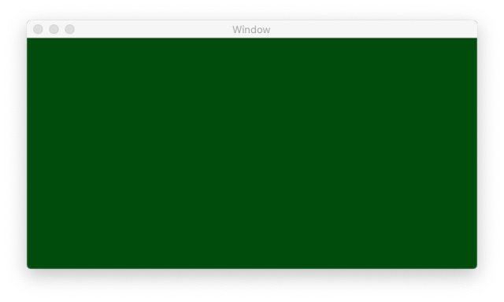
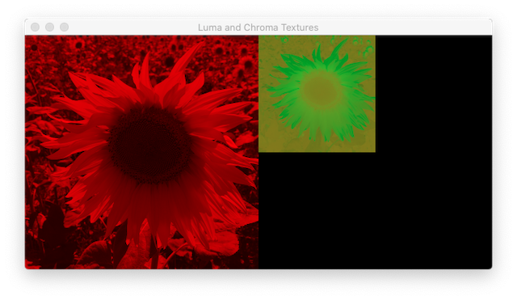

### Convert Image From RGB to YpCbCr color space

 
 

This demo is an alternative to the demo **LumaChroma2RGBConversions**. Whereas the latter program uses Metal to convert RGB formatted images to YpCbCr images, much of the workload of this program is carried out by the CPU using the functions of vImage which is part of the *Accelerate* framework. *CoreImage*, *CIImage* and *CVPixelBuffer* functions are called during the conversion process.

Since the rendering of the images is Metal-based, all textures are instances of the class *MTLTexture*.
 
 

**Problem encountered:**

Logically, once the biplanar *CVPixelBuffer* object is created, we should call the functions, **CVMetalTextureCacheCreate**, **CVMetalTextureCacheCreateTextureFromImage** and **CVMetalTextureGetTexture** to instantiate the MTLTextures, *lumaTexture* and *chromaTexture*. However, these 2 textures and *RGBTexture* cannot be rendered in the main draw loop (`drawInMTKView:`) of MetalRenderer. What is observed is a view which is entirely green.

 
 

 
 

When the camera icon on the debugging toolbar is clicked, a purple exclamation mark appeared on central part of the tool bar.

Several messages appeared on clicking the purple exclamation mark. All are similar to that below:

    Memory Usage'Texture:0x10061a3f0 "CoreVideo 0x60000175da00"' has storage mode 'Managed' but is accessed exclusively by a GPU.

Apparently, the system has flagged the resources as private even though the texture's storage mode is managed. It is likely a graphics driver problem.

 
 

**Expected Output:**

 
 

The user is allowed to save both the luminance and chrominance textures.
 
 

**Development Platform:**

XCode 11.6, macOS 10.15

 
 

**Web-links:**

https://dev.to/petertech/reducing-jpeg-uiimage-ram-usage-by-50-2jed
